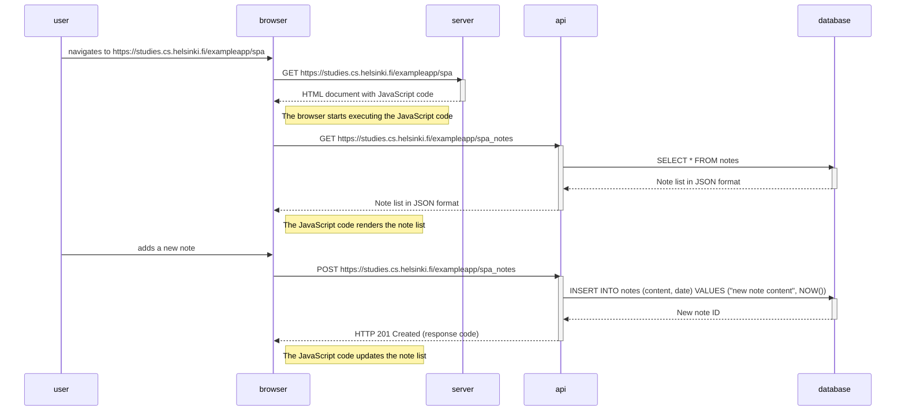

```mermaid
sequenceDiagram
    participant user
    participant browser
    participant server
    participant api
    participant database

    user ->> browser: navigates to https://studies.cs.helsinki.fi/exampleapp/spa
    browser->>server: GET https://studies.cs.helsinki.fi/exampleapp/spa
    activate server
    server-->>browser: HTML document with JavaScript code
    deactivate server
    Note right of browser: The browser starts executing the JavaScript code

    browser->>api: GET https://studies.cs.helsinki.fi/exampleapp/spa_notes
    activate api
    api->>database: SELECT * FROM notes
    activate database
    database-->>api: Note list in JSON format
    deactivate database
    api-->>browser: Note list in JSON format
    deactivate api
    Note right of browser: The JavaScript code renders the note list

    user ->> browser: adds a new note
    browser->>api: POST https://studies.cs.helsinki.fi/exampleapp/spa_notes
    activate api
    api->>database: INSERT INTO notes (content, date) VALUES ("new note content", NOW())
    activate database
    database-->>api: New note ID
    deactivate database
    api-->>browser: HTTP 201 Created (response code)
    deactivate api
    Note right of browser: The JavaScript code updates the note list
```
