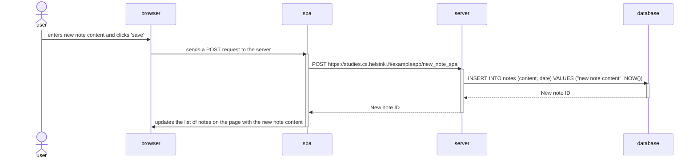

```mermaid
sequenceDiagram
    actor user
    participant browser
    participant spa
    participant server
    participant database
 

    user ->> browser: enters new note content and clicks 'save'
    browser ->> spa: sends a POST request to the server
    activate spa
    spa ->> server: POST https://studies.cs.helsinki.fi/exampleapp/new_note_spa
    activate server
    server ->> database: INSERT INTO notes (content, date) VALUES ("new note content", NOW())
    activate database
    database -->> server: New note ID
    deactivate database
    server -->> spa: New note ID
    deactivate server
    spa ->> browser: updates the list of notes on the page with the new note content
    deactivate spa

```
