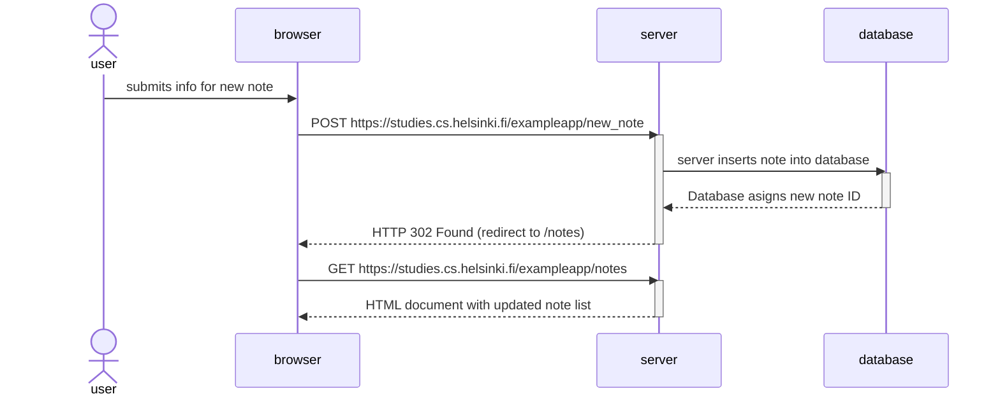

```mermaid
sequenceDiagram
    actor user
    participant browser
    participant server
    participant database

    user ->> browser: submits info for new note
    browser->>server: POST https://studies.cs.helsinki.fi/exampleapp/new_note
    activate server
    server->>database:server inserts note into database
    activate database
    database-->>server:Database asigns new note ID
    deactivate database
    server-->>browser: HTTP 302 Found (redirect to /notes)
    deactivate server

    browser->>server: GET https://studies.cs.helsinki.fi/exampleapp/notes
    activate server
    server-->>browser: HTML document with updated note list
    deactivate server
```
